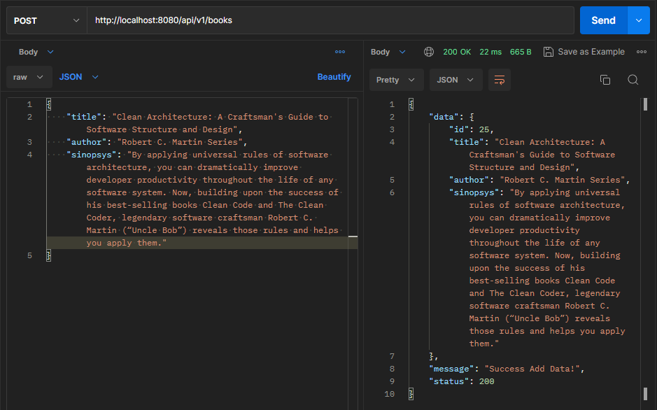
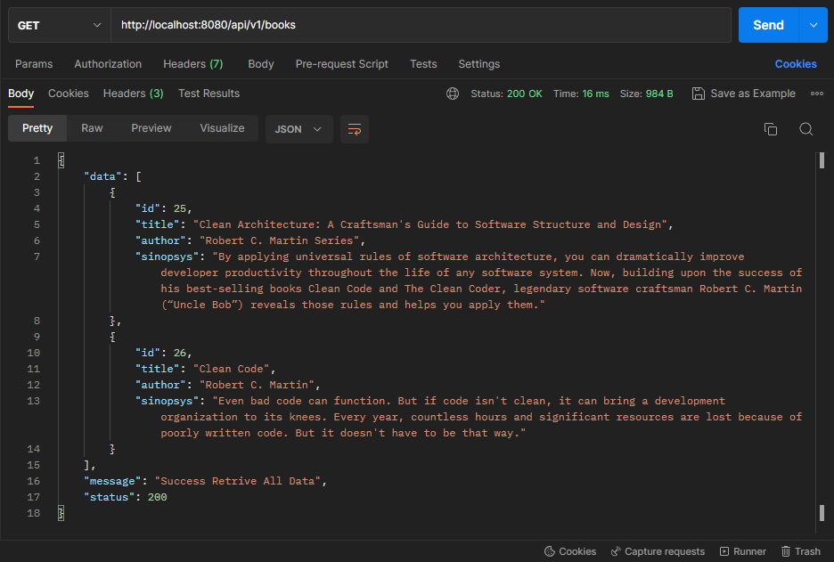
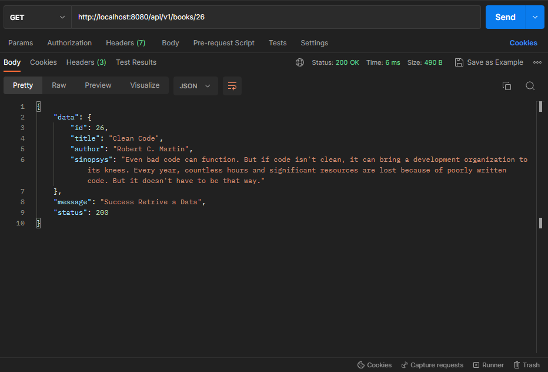
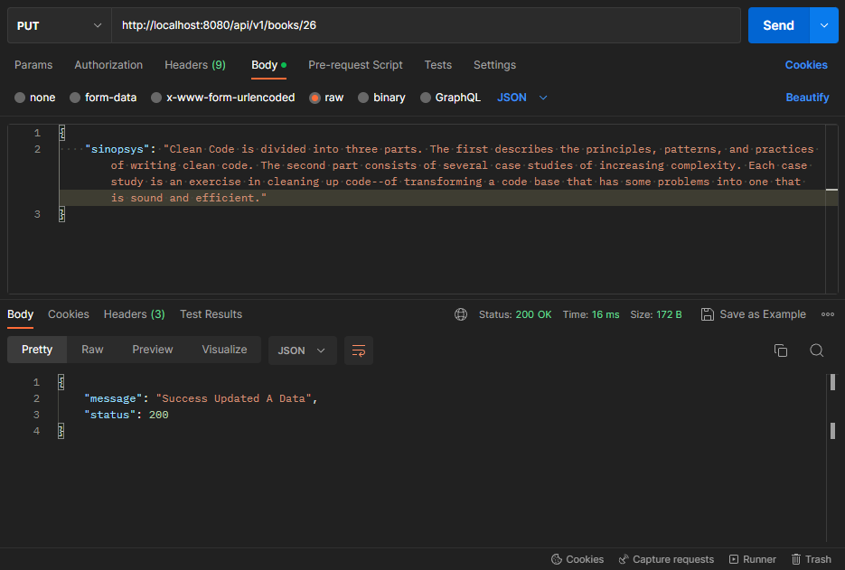
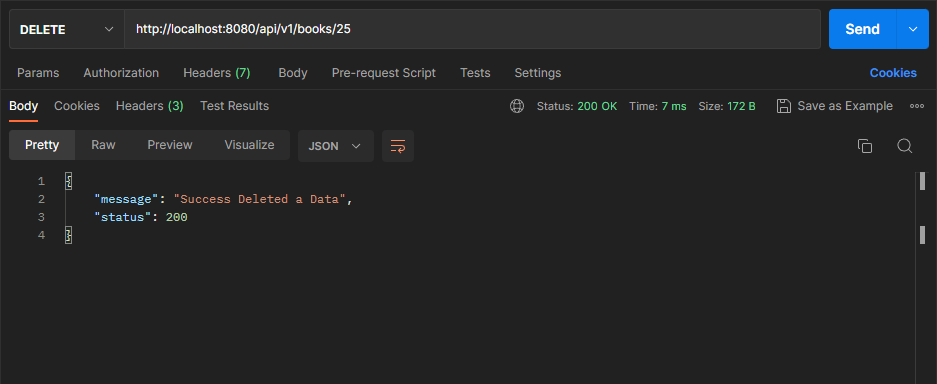

# library-api
Library API adalah RESTful APIs yang dapat digunakan untuk mengakses data dari buku-buku seputar pemrograman. Library API dibangun dengan pendekatan Clean Architecure. Adapun fitur yang terdapat saat ini berupa Create, Read, Update, Delete Book. 

Library API still under constraction :man_technologist:	

## Postman Documentation 

### Create a Book

### Get All Books

### Get Detail a Book

### Update a Book

### Delete a Book

